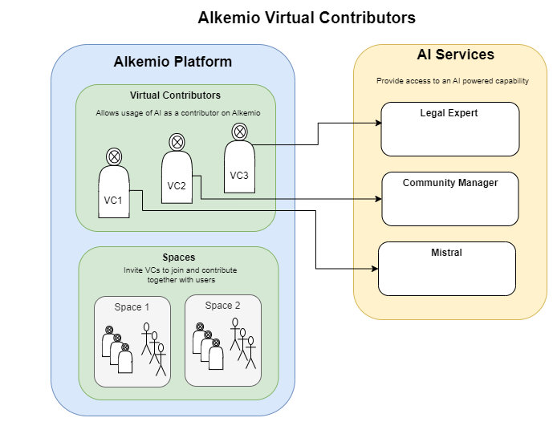
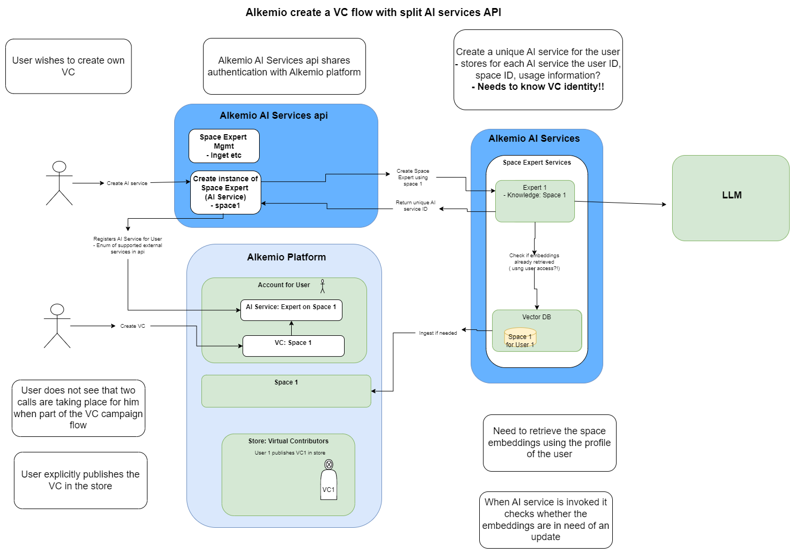
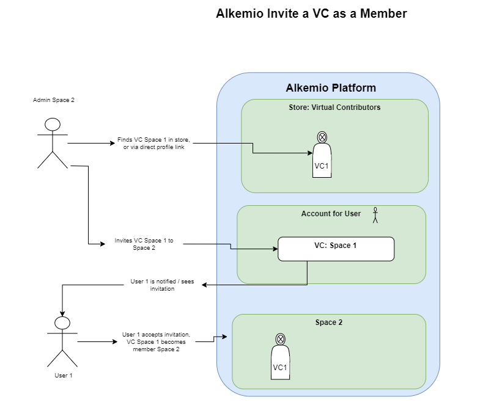

# AI + Virtual Contributors 
This document provides a conceptual explanation of how AI is leveraged on the Alkemio Platform, including for the creation of Virtual Contributors (TM).

## Virtual Contributors

The high level conceptual model for usage of AI to power Virtual Contributors on Alkemio is shown below. 

A **Virtual Contributor** allows usage of an AI service as a contributor on Alkemio. 

An **AI Service** provides access to an AI powered capability e.g. Legal expert, community manager etc. 

Logically the AI service should be thought of as being outside of Alkemio. 

However Alkemio also does provide the ability to easily create and work with AI services that are specific to the type of data or roles on Alkemi0. 

## Benefits of Virtual Contributors 
* Provide transparency on the remote AI service
    * What capability is it providing?
    * What type of LLM is behind it?
    * What organization is providing it?
    * What knowledge does it have?
    * What type of interaction modes, as well as agency, can it have?
    * What awareness does it need to have when used?
* Allow for reputation and attestations on the VC
* Allow for the context, where a VC is being used, to be automatically provided to the VC
    * This would be for example by allowing differing levels of information about the Space (where the VC is operating) to be sent along with the question.
* Allow for many-to-many interactions with VCs
    * This is in sharp contrast to the typical one to one interaction that happens with an AI service (e.g. ChatGPT)

Eventually a Virtual Contributor should be able to build up a reputation. 

The underlying model to keep in mind is that of a normal user. What knowledge does that person have? What can they do? 

To support this mental model, many aspects of a VC **cannot** be modified after the VC is made available.

## **Creating a Virtual Contributor (VC)**
To create a VC, access needs to be provided to an AI service.

To make getting started with Virtual Contributors straightforward, Alkemio also provides the ability to easily create AI services.

### Provider
Each VC is created within an Account on Alkemio. Each Account on Alkemio has either a Host user or organization. The Host User or Organization is then the **Provider** of the VC.

### Visibility
A VC has the following visibility modes:
* **Private**: the VC is only usable within the same account where it is hosted
* **Public**: all other Spaces on Alkemio can invite the VC to join their community.

In addition a VC can also optionally choose, when Public, to be listed in the **Alkemio Store**. This makes it easier for other Spaces on Alkemio to find and invite the VC.

### Lifecycle
A VC has a lifecycle associated with it, going through the following phases:
* **Draft**: a VC in this state is being defined and populated. It can only have Private visibility when in this state.
* **Active**: The VC has being published, and core information about the VC can no longer be edited. Later there may be a submission / approval flow for turning a VC active on the Platform. 
* **Inactive**: The provider of a VC can at any point decide to turn a VC Inactive, which then results in the Store listing being disabled, no new interactions with VC being possible and its visibility mode is turned to Private. A VC that is Inactive may be turned Active again, and made Public again.

### Data Model
The following information is associated with a VC:
* **Profile**: This is information that the provider of a VC can fill out
    * It includes an Avatar, name, description, links and tags. 
* **Knowledge**: The specific information that is available to the AI when answering questions. 
    * For example for a Space Expert, this would be the information in the Space used to create the AI service. 
* **Personality**: The type of responses that the AI provides. For example, serious, verbose, humorous etc.
* **Interactions**: The types of interactions that are supported. 
    * For now the only option is "Question and response". 
* **Awareness levels**: The levels of information that can be supplied to the AI to achieve the best response. 
* **Response types**: The types of responses that can be provided by the AI behind the VC. 
    * For now the only option is "Text". 

In addition, the provider of the VC (user, organization) is also displayed. 

Finally, to create additional trust in the VC, the roadmap includes the ability for attestations to be attached to a VC. This leverages credentials (signed) to allow multiple levels of information to be attached. Examples could include:
* Trusted by organizations
* Certifications (think along the lines of a movie age rating), for aspects such as biases.
....

## **AI Services**
The AI services that are used are logically *separate from the Alkemio platform*. 

However, there are already services, as well as the ability to create new services, that have been identified and implemented - below are more details.

The chosen logical model is to allow many external AI services to be plugged in and used safely on Alkemio. 

## **Alkemio AI Service Creators**
The following capabilities for creating AI services are provided by Alkemio.

### Space Expert Creator
This AI service allows you to create a "Space <abcd> Expert" AI service, allowing interaction with the contents of a Space. The contents of the specified Space, including files that are uploaded as links, are converted into a *Body of Knowledge*.

This AI service makes it easy to create In essence it is allowing the easy creation of an AI expert on a body of knowledge you control.

The Space Expert is created by specifying a particular Space on Alkemio as the source body of knowledge. It hopefully goes without saying that the user creating the Space Expert needs to have the rights / permissions to be able to share the contents of the specified Space.  

This allows a) creation of a new body of knowledge b) treating communities and their interactions as a body of knowledge. 

The latter makes a powerful route to allowing the collective wisdom of a community to be shared easily and safely with other communities. 

The detailed flow for creating a new VC based on an instance of the Space Expert VC service is shown below:

## **Alkemio AI Services**
The following dedicated AI services are provided by Alkemio:

### Alkemio Help
This AI service has access to all information stored on the public Alkemio websites (https://welcome.alkem.io, https://alkemio.org) - including Alkemio help contents. 

## Using a VC within a Space
Once a VC is created, the next step is to use that VC as a contributor in one or more communities.

### Private VC + addition
When a VC is private, then it can only be used in Spaces within the same Account where it is hosted. 

For spaces (and subspaces) within the Account, the VC can be directly added.

### Public VC + invitation
When a VC is public, it can be **invited** to become a member of any Space on Alkemio. 

The key steps in this flow are shown below:

**Finding the VC**
The Space that wishes to use the specific VC needs to find the VC to be invited. There are two options for this:
* **Browse the Alkemio Store**: by far the easiest, but it does require the VC provider to have also chosen for the VC to be in the store.
* **Invitation via VC profile link**: Each VC has a profile page associated with it. If the link to the profile of the VC is shared then this can be used to invite the VC.

**Inviting the VC**
Once the VC is found, the inviter then can view the profile of the VC - and importantly make choices related to the membership that is being offered. In particular:
* Interaction mode: what type of interactions should the VC have as a contributor in the space?
* Context awareness: how much of the environment in which the VC is a member should be shared with the VC? The more context the more situational awareness the VC has when providing responses / acting.
* Role: is there a particular role the VC should have, beyond member, in the community?

**Accepting the invitation**
Once the invitation is sent, the provider of the VC will be notified of the invitation. The provider then has the option to accept or reject the invitation.

**Payment**
The question of "payment" for being able to interact with a VC as a member in a Space is one that is still being explored. The ideal scenario is that this payment can be facilitated via the platform, the alternative is to make a separate out of band agreement.

### Removing memberships
At any time the provider of a VC can choose to remove the VC as an active member of a Space community. 

### Usage notes
The following points are important when considering the usage of VCs:
* The responses provided by the VC are content of the Space where the VC is a member
* Depending on the VC, the response may indirectly be providing access to information that the AI service behind the VC is using to create responses. 

In addition, for VCs using the Space Expert creator AI services, the responses contain links to information in the Space whose content is being digested as knowledge. These links may or may not be accessible to other members of the Space where the VC is a member.

### Interaction
The default interaction mode for interacting with a VC is via tagging at the start of a comment, to which the VC will reply.

If the User starts a new top level tagging, then a new chat history is created with the VC.

If the User replies to the response from the VC, then the conversation is threaded i.e. the User can add additional context / instructions to shape the response. 

## Roadmap
There are many dimensions to expand the VC capability on Alkemio. 

### Interaction Modes
Allowing the VC to be used separate from a question + response approach. For example that the VC has agency and can without being prompted contribute e.g. provide a weekly summary of the space activity. 

### Additional Interactions patterns with VCs
This is about providing additional modes for Users to interact with a VC:
* **One-one**: allowing Users to interact with one-one with a VC. The access controls are still to be determined. One option would be that this interaction is within a Space, but that the interaction is not visible to all  one-one, outside of membership of a Space. It may be that this is only feasible within the context of a Space, with the interaction then taking place in a direct conversation for the User.
* **Refine before visible**: Allowing a User to refine the answer from a VC via interactions before making it visible in the wider community. 

### AI Usage separate of VCs. 
It is also highly likely that additional usages of AI will be provided within the Alkemio platform. In other words, allowing access to AI outside of VCs. For example, for the generation of avatars.

### Easy embedding of Alkemio data
This is about making it easier for other AI services, with appropriate access permissions, to be able to access and emded the data from Alkemio in the knowledge available to that AI. 

