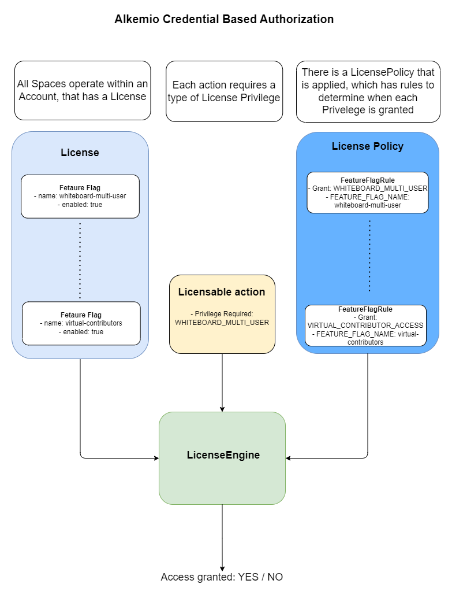

# License Enforcment 
This document provides a detailed overview of how entitlements to access functionality is managed within the Alkemio platform. 

The high level design for the License Framework is shown below. 
<p align="center">

</p>

This is currently a fairly straightforward design, acting as the base for a near term much more comprehensive and flexible license enforcement.


## **Design**
The design is very similar and based on the [Credential Based Authorization](./credential-based-authorization.md) framework that is used to manage Authorization.

Key concepts:
* **License Privilege**: a simple flag that can be checked at runtime to see if an action is allowed. E.g. access a whiteboard in multi-user mode.
* **License**: the domain entity holding information that is used to determine the entitlements (privileges) that should be granted.
* **License Policy**: defines what LicensePrivileges are granted based on the information in the supplied License. It is a set of rules.
  * There is currently a single global License Policy that is managed at the Platform level.
  * Note: design should allow for multiple LicensePolicies to be in use, even if there is only one at the moment. Otherwise we could end up with just ginormous sets of rules etc over time. It is also feasible to think that there may be different licenses applied in different contexts etc.
  * The initial version of the License Policy works with LicensePolicyFeatureFlagRules, so very simple rules that simply check whether a Feature Flag is enabled or not on a License. 
* **License Engine**: Used by the business logic at runtime to determine whether the currently applicable License results in a License Privilege being granted. 
  * Importantly this engine has to be essentially free of other server dependencies, so that it can later be isolated out into a separate microservice.

## **Usage**
To see the Platform level license policy:
```
query {
  platform {
    licensePolicy {
       id
      authorization {
        id
        myPrivileges
      }
      featureFlagRules {
        name
        grantedPrivileges
        featureFlagName
        
      }
    }
  }
}
```

To see the set of License Privileges that are granted to a given License:
```
query {
  spaces {
    account {
      license {
        privileges
      }
    }
  }
}
```


