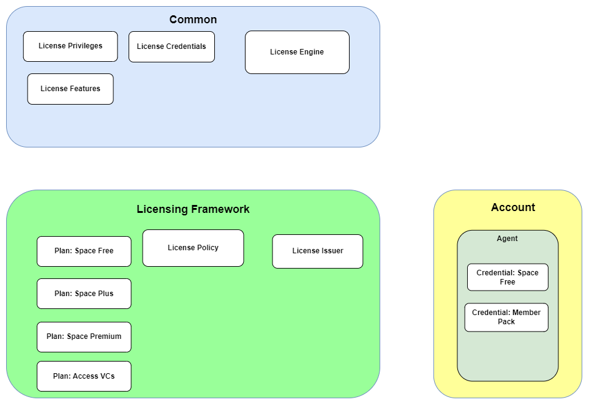

# License Enforcement 
This document provides a detailed overview of how entitlements to access functionality is managed within the Alkemio platform. 

The high level design for the License Framework is shown below. 
<p align="center">

</p>

This is currently a fairly straightforward design, acting as the base for a near term much more comprehensive and flexible license enforcement.


## **Credential Based Licensing**
The design is very similar and based on the [Credential Based Authorization](./credential-based-authorization.md) framework that is used to manage Authorization.

Key concepts:
* **License Privilege**: a simple flag that can be checked at runtime to see if an action is allowed. E.g. access a whiteboard in multi-user mode.
* **License Credentials**: the set of Credentials, from the Account Agent..
* **License Policy**: defines what LicensePrivileges or LicenseEntitlements are granted based on the information in the LicenseCredentials supplied. It is a set of rules.
  * There is currently a single global License Policy that is managed at the Platform level.
  * Note: design should allow for multiple LicensePolicies to be in use, even if there is only one at the moment. Otherwise we could end up with just ginormous sets of rules etc over time. It is also feasible to think that there may be different licenses applied in different contexts etc.
  * The initial version of the License Policy works with LicensePolicyFeatureFlagRules, so very simple rules that simply check whether a Feature Flag is enabled or not on a License. 
* **License Engine**: Used by the business logic at runtime to determine whether the currently applicable License results in a License Privilege being granted. 
  * Importantly this engine has to be essentially free of other server dependencies, so that it can later be isolated out into a separate microservice.

## **Logical Design**
A more details logical model of how the different parts of the Licensing setup on Alkemio operates is shown below:. 
<p align="center">

</p>

### Licensing Common
* **License Credentials**: credentials specific to licensing
* **Privileges**: The set of flags that can be checked for
* **Credentials**: The set of credentials that are used for licensing
* **Features**:  The usage that is not boolean based but has actual numbers e.g.10 users editing a whiteboard
* **Engine**: The actual run time evaluation of whether an action should e allowed

### Licensing Framework
This defines the setup of the Licensing within a given scope. In principle there could be multiple Licensing Frameworks in use, although there is at the moment just one at the platform level 

Key entities:
* **License Plans**:  definitions, what is available to use
Policy
* **License Policy**:  Grants License Privileges / License Entitlements based on a given set of "evidence" (credentials)
Issuer
* **License Issuer**:  Knows how to convert a Plan to credentials

### License Usage
All Licensable actions on the platform take place under an Account. 

An Account has an Agent with a set of License Credentials. 

At runtime, when a particular action is to be carried out (add another member to a Space), the Agent from the relevant Account is used to determine if the action is allowed. 


## **Usage**
To see the Platform level license policy:
```
query {
  platform {
    licensePolicy {
       id
      authorization {
        id
        myPrivileges
      }
      featureFlagRules {
        name
        grantedPrivileges
        featureFlagName
        
      }
    }
  }
}
```

To see the set of License Privileges that are granted to a given License:
```
query {
  spaces {
    account {
      license {
        privileges
      }
    }
  }
}
```


