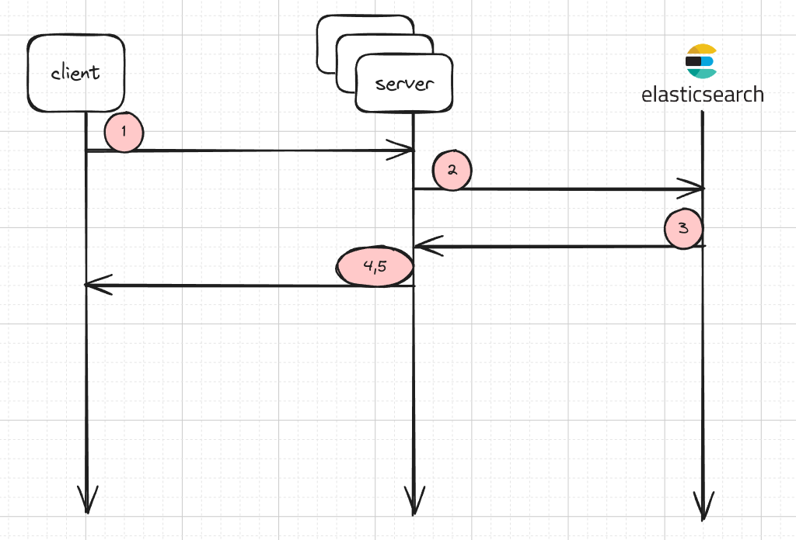
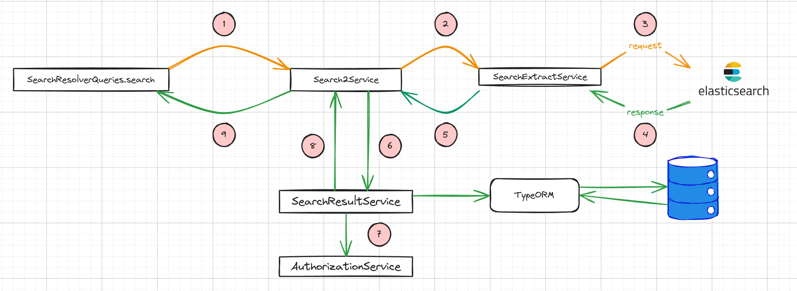
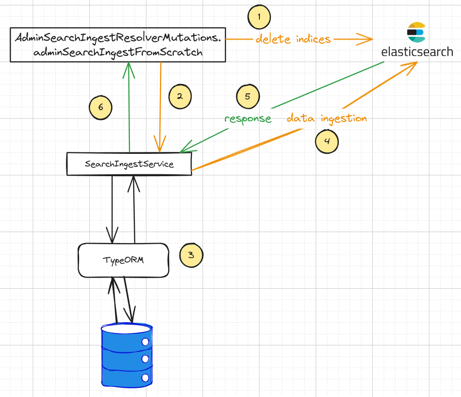

# Search v2: Design and implementation using Elasticsearch

    

## High level design
1. The client does a search request with terms and which types entities to return, e.g. `Contributors` - `User`, `Organization`.
2. The server transforms this request to an `Elasticsearch` query using the `Query DSL`.
In addition, it applies a score function to change the final score of the returned documents based on predefined filters.
3. `Elasticsearch` returns the results in form on document array, each per record in the database.
4. Each of the returned document is authorized and then enriched with data, specific to the entity type.
5. Metadata is attached to each result, like score and an identifier.

---

## Detailed design

    

1. Search query with input filter
2. The search service is using both the extract service to perform a search, using `Elasticsearch`, 
and the result service, to return the results to the client using the GraphQL schema.
3. Builds a query based on the input filters and uses `Elasticsearch Query DSL`.
   A score function is also defined, which applies custom scoring over the filtered (returned) documents.
4. The returned documents from `Elasticsearch` are mapped to a simple base object, with some metadata like score, identifiers, etc.
5. Mapped search results are returned back to `Search2Service`
6. `Search2Service` is using `SearchResultService` to enrich the raw documents from `Elasticsearch`. This also includes helper fields, like the Space, `Challenge`, `Subspace` for a `Post`.
Consult the GraphQL schema for all the available fields.
7. Each already enrich document (entity) is authorized against the user who is searching. The user needs the READ privilege in order to have access to the entity.
8. All the results are compiled in a few categories, ordered by score, and sent back to `Search2Service`.
9. `Search2Service` passes the results from the past steps as is.

---

## Ingest design

    

1. The server tries to delete the indices if they exist
2. `SearchIngestService` is used to ingest a subset of data.
3. The data is loaded fom the Alkemio database using `TypeORM`.
4. Data is ingested in a single bulk request PER entity type.
5. The response from `Elastic` is checked thoroughly for problems. They are logged and the results and errors are mapped to a typed object.
6. `SearchIngestService` returns a mapped result object, consisting of all the successes and problems related to the ingest process.
Partial ingested data can occur. Errored documents can be re-ingested in a later stage if the problem was not blocking.

## Ranking
[Function Score Query](https://www.elastic.co/guide/en/elasticsearch/reference/2.4/query-dsl-function-score-query.html) is used to add custom scoring to the results based on visibility. This give us great flexibility over the query you execute at runtime. **We can choose different scoring function at runtime, based on the user, the context, etc.**

### Boosting criteria

`visiblity=active` adds a weight of `2` to the document 
`visiblity=demo` adds a weight of `1` to the document. 
`visiblity=archived` adds a weight of `0` to the document. 
`NOT EXIST visiblity` adds a weight of `1` to the document.

**No other fields are boosted.**
It sounds logical to boost fields like `displayName`, `tagline` but **they are boosted by default using a [field-length norm](https://www.elastic.co/guide/en/elasticsearch/guide/current/scoring-theory.html#field-norm)**.
Fields with more terms like `description`, `vision`, etc. have a normalized score of `1/sqrt(terms)` which naturally punishes fields with more text.